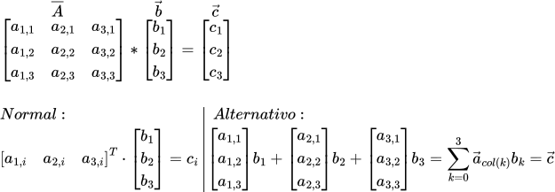

== Gargalo de Von Neumann e a cache

=== Introdução
O desempenho de programas e algoritmos é um fator determinante na viabilidade de aplicações desde antes dos computadores
como os temos hoje existem. Como em um ciclo de realimentação, problemas e algoritmos para resolvê-los promovem avanços
na capacidade dos sistemas computacionais, enquanto que os sistemas computacionais atuais influenciam no uso ou
elaboração de novos algoritmos e aumento da carga computacional de algoritmos já existentes. Com o passar do tempo,
entretanto, os aprimoramentos de performance nos computadores se manifestam por meios menos triviais que somente o
aumento da velocidade dos processadores, mas pela introdução de novas componentes às máquinas que, por seu natureza,
necessitam de uma mínima consideração do desenvolvedor para que sejam aproveitadas devidamente. Neste texto, abordamos
uma limitação nos computadores consequente de seu mais famoso modelo: o Gargalo de Von Neumann, e uma das primeiras 
tentativas de amenizá-la, a cache; demonstrando a importância de se implementar algoritmos amigáveis a cache com
a comparação de três soluções diferentes para a multiplicação entre matriz e vetor.

==== O Gargalo de Von Neumann
__Pesquise todo termo que te despertar interesse__  

Pela primeira metade do século XX os computadores eram limitados a aplicações específicas e caminhávamos vagarosamente
na programabilidade de máquinas computadoras, com sistemas que deviam ser rearranjados fisicamente para diferentes
programas — como o ENIAC —, e entrada/saída de dados para meios externos — como os cartões perfurados das máquinas de
tabulação da IBM. A máquina de Turing havia sido elaborada como modelo abstrato de um computador e então expandida no
conceito da máquina de turing universal, capaz de armazenar na sua fita infinita tanto os dados de entrada de um
programa como o programa em si. Trabalhando no conceito de um computador de programas armazenados para o EDVAC, John von
Neumann descreveu no "Primeiro esboço de um relatório do EDVAC" um dos primeiros projetos de um computador desse tipo,
com a repercussão do documento influenciando o design desde os computadores da época até os atuais com a chamada
arquitetura de Von Neumann.

Uma limitação desta arquitetura, entretanto, consiste no armazenamento, a princípio de instruções, junto à memória de
dados, onde toda a velocidade de execução do processador estaria limitada à taxa de transferência da memória a ele para
o processamento. Esta limitação, cunhada como "o gargalo de Von Neumann" por John Backus, enquanto que referente às
restrições causadas pelo armazenamento e repartição da memória e seus barramentos para dados e instruções, não se
distancia muito da noção mais genérica de algoritmos limitados pela memória (memory-bound). Para tentar amenizar este
problema, temos, principalmente, a cache.

==== Cache
A cache é uma memória intermediária entre a memória principal (RAM) e os registradores, atuando de forma "invisível" ao
processador, mantendo dados e/ou instruções a serem utilizadas pelo programa para diminuição dessa limitação por acesso.
Para decidir o que manter e/ou o que adicionar de dados à cache para minimizar os acessos à memória principal, são
seguidos os princípios de localidade espacial e temporal, referentes respectivamente à tendência que dados próximos
entre si na memória sejam acessados próximos no tempo; e a tendência de dados serem repetidamente acessados. Decorrente
disso, o quão mais um algoritmo (ou implementação de algoritmo) encaixe nestes princípios, mais se é aproveitado da
cache.

=== Experimento: Comparação do efeito de diferentes ordens de acesso na multiplicação matriz-vetor
Para se demonstrar o efeito do aproveitamento do cache no desempenho de um, elaboramos três implementações de
multiplicação entre matriz e vetor. A depender da linguagem de programação, ferramenta de compilação, biblioteca e/ou
solução própria, matrizes são comumente armazenadas na memória de duas formas: alinhadas por linha, ou alinhadas por
coluna. Este alinhamento se refere a ordem de sucessão dos elementos da matriz na memória, onde cada M ou N
elementos da linha ou coluna são armazenados em série, favorecendo acessos na mesma ordem de alinhamento. Levando em
conta o algoritmo padrão de multiplicação de matrizes que nos é ensinado, onde cada linha do vetor de saída recebe o
produto interno do respectivo vetor linha da matriz de entrada com o vetor de entrada, o uso de matrizes alinhadas por
coluna iria de contramão ao princípio da localidade espacial, já que cada elemento acessado sucessivamente na matriz
estaria espaçado por tantos elementos quanto o número de colunas da matriz. Para comparação desse efeito, duas das
implementações são este algoritmo aplicado a diferentes alinhamentos, enquanto que a última implementa a multiplicação
como uma soma dos vetores coluna da matriz de entrada ponderada pelos escalares das linhas do vetor de entrada.

.Representação matemática das implementações: "Normal" sendo melhor para alinhamento por linha, enquanto que "Alternativo" sendo melhor para alinhamento por coluna.

=== Resultados

ifdef::backend-html5[]
++++

Se você está vendo isso aqui, o script do plot deu pau

++++
endif::backend-html5[]

Como no gráfico desnecessariamente interativo, podemos ver o impacto da cache na implementação COL_ORDER
(algoritmo padrão, matriz alinhada por coluna) começando entre lados de 1500 a 2000 elementos, onde a variação de espaço na cache
disponível decorrente da operação normal do computador gera mais instabilidades no tempo de execução das multiplicações,
dado que os elementos de uma mesma linha mais distantes entre si tendem a ser substituídos pela falta de acessos
próximos (localidade espacial) e relativa inatividade desde seu último acesso (localidade temporal). A partir dos 3000,
temos um overhead mínimo observado de 150% em relação ao ROW_ORDER (algoritmo padrão, matriz alinhada por coluna). 
Apesar da causa do efeito se dar principalmente pelo cache, não se pode relacionar diretamente estas faixas de tamanhos
alocados à memória do programa com o tamanho da cache. Dado a concorrência de execuções de instruções e fetching de
dados dos processadores modernos, acessos a memória teriam um impacto quando o tempo de execução das instruções for
menor que o tempo de acesso. Isso serve para a discordância entre os tamanhos de matrizes e o cache: usando o memcheck
do Valgrind ou calculando à mão o máximo de mamória alocada, verifica-se que o cache L1 é teoricamente esgotado muito
mais cedo que o encontrado para sinalizar diferenças, p.ex. O algoritmo dedicado a matrizes ordenadas por coluna,
entretanto, obteve os melhores tempos da comparação entre as três implementações, aproveitando de um fator futuramente
abordado de otimização para hardware.

=== Relacionados

- Computer Architecture: A Quantitative Approach (é um livro do patterson, não O livro do patterson, 
o Computer Organization and Design é o que se veria em Arquitetura de Computadores);
- O algoritmo alternativo de multiplicação de matriz por vetor me foi apresentado na disciplina de Computação Gráfica, o
link:https://www.dca.ufrn.br/~lmarcos/courses/compgraf/notes/index.html[slide referente a nota de aula 3] contém breve
menção do método;

=== Íntegra dos códigos:

.main.cpp
[%collapsible]
====
[source,c++, linenums]
----
include::main.cpp[]
----
====

.run_tests.sh
[%collapsible]
====
[source, shell, linenums]
----
include::run_tests.sh[]
----
====
.process_data.py[]
[%collapsible]
====
[source, python, linenums]
----
include::process_data.py[]
----
====